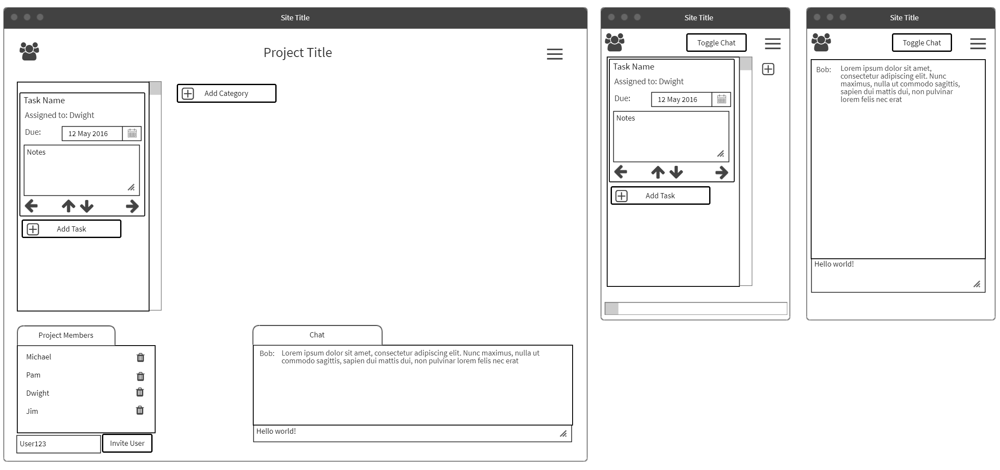
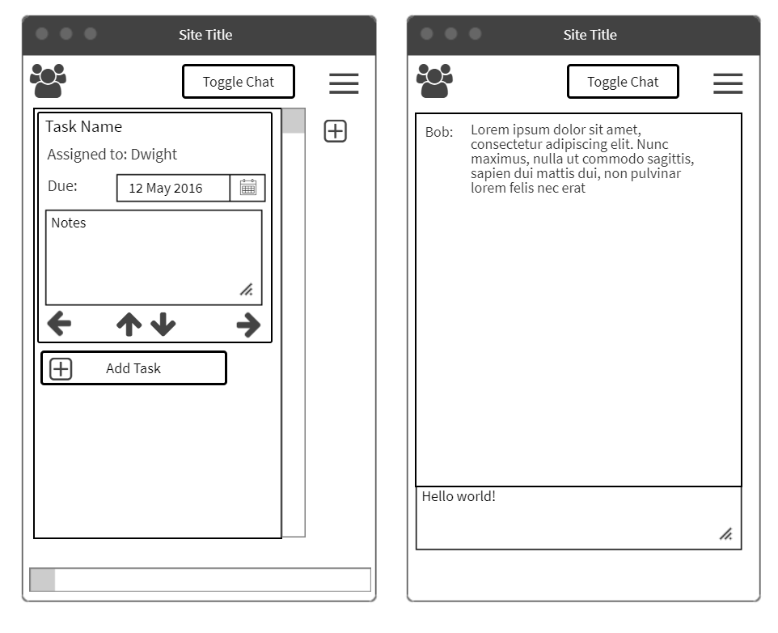

## we ¯\_(ツ)_/¯ do

A kanban board for organizing tasks using categories and tags, implemented with React on the front end and Node.js on the back end.

[Demo](https://we-do.pmnord.now.sh/)

[Backend Documentation](https://github.com/pmnord/todo-management-react-capstone-server)

| | | | | |
|-|-|-|-|-|
|**Front-End**|React|ES10|CSS3||
|**Back-End**|Node.js|Express|PostgreSQL|RESTful API|
|**Development**|Jest|Mocha|Chai|Heroku|Zeit|
| | | | | |

## Views

### Landing Page

Supports user registration and log in.

// Add screenshot

### Application Page

Create categories, create tasks, tag your tasks, move your tasks, filter your tasks, share your board with others!

// Add screenshot

## Site Map & User Flow

- Create board or get link
  - Add categories to your board
    - Add tasks to your categories
      - Set tags and comments on your tasks
        - Share your board with others

## Mockups

## Entity Relationships (PostgreSQL tables)

|Users|Projects|Categories|Tasks|Project_Users|
|-|-|-|-|-|
|id|id|id|id|id|
|username|name|name|title|project_id|
|password|user_id|project_id|category_id|user_id|
|project_id|||assigned_user||
||||due_date||
||||note||
||||priority||

## Developer Roadmap
- Refactor to use Context API
- Refactor to use React Hooks
- Support multiple projects by the same user
- Support shared projects and concurrency with websockets
- Support drag and drop task movement with react-dnd

## User Stories

- As a user I can create categories so I can organize my tasks
- As a user I can create task cards so I can track the status and details of my tasks
  - As a user I can set due dates on tasks so I can accomplish them on time
  - As a user I can set notes on tasks so I can clarify any details or special cases related to the task
  - As a user I can move tasks up and down the priority queue
  - As a user I can move tasks between the columns
- As a user I can chat with members of my team so I can collaborate on tasks
- As a user I can see which tasks are assigned to me so I can work on them
- As a user I can assign tasks to myself or others so we can delegate work
---
- As an admin I can see the users currently on my project
- As an admin I can add and remove users from my project so I can allow team members to collaborate on tasks
---
- As a user I can create an account so I can use the app
- As a user I can log in to my account so I can use the app
- As a user I will be automatically logged off the app after not interacting for a period of time so my account will be secured