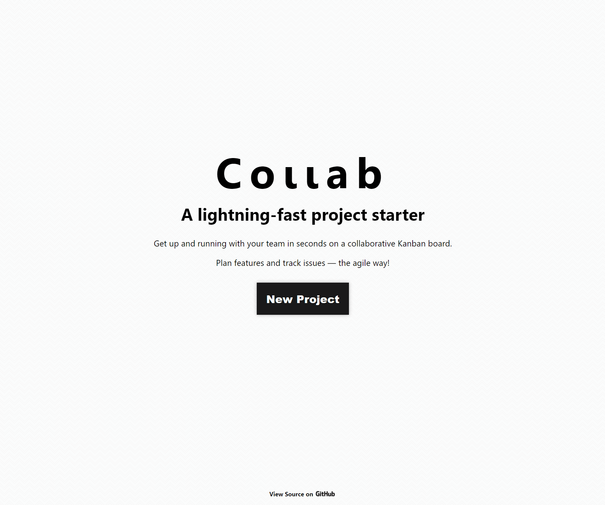
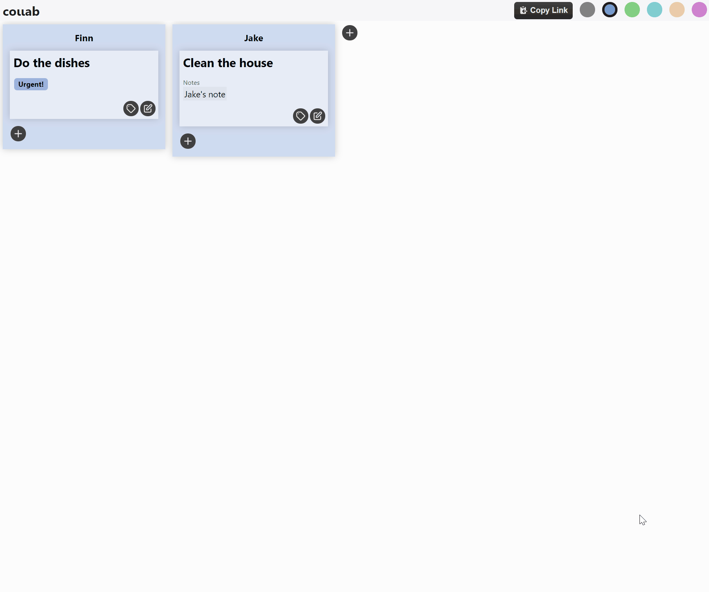

# Collab

Collab is a lightweight kanban issue tracker supporting concurrent users over web sockets.

**<u>[Demo](https://wedo.pmnord.now.sh/)</u>**

<u>[Backend API Documentation](https://github.com/pmnord/todo-management-react-capstone-server)</u>

## Technologies

|                 |         |         |            |          |
| --------------- | ------- | ------- | ---------- | -------- |
| **Frontend**   | React   | HTML5   | ES10       | CSS3     |
| **Backend**    | Node.js | Express | PostgreSQL | REST API |
| **Development** | Jest    | Mocha   | Heroku     | Vercel   |
|                 |         |         |            |          |

## Project Views

Create categories, tasks, tag your tasks, drag and drop everything, and share your board with others in real time.

### Project Creation

### Synchronous Collaberation

## User Flow

- Create board or get link to an existing project
  - Interact with categories
    - Create categories
    - Move categories
    - Delete categories
  - Interact with tasks
    - Create tasks
    - Set tags
    - Set comments
    - Move tasks
    - Delete tasks
  - Other
    - Copy invite link and invite more users
    - Style the app

## Original Conceptual Mockups

### Desktop

### Mobile

## Developer Roadmap

1. Users can set colors on individual tasks and categories
1. Users can set a due date on tasks
1. Users have unique names that are visible in a users container
1. Users can see when other users are moving a draggable

- Enable session affinity on Heroku if you expand to more than one dyno
