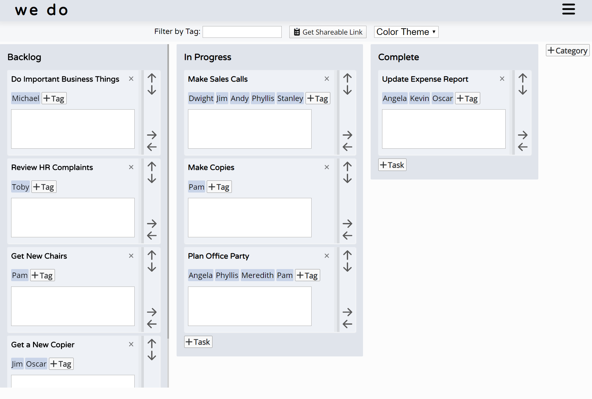

## Collab

Collab is a light-weight kanban issue tracker supporting concurrent users.

[Demo](https://wedo.now.sh/)

[Backend Documentation](https://github.com/pmnord/todo-management-react-capstone-server)

|                 |         |         |            |             |
| --------------- | ------- | ------- | ---------- | ----------- |
| **Front-End**   | React   | HTML5   | ES10       | CSS3        |
| **Back-End**    | Node.js | Express | PostgreSQL | RESTful API |
| **Development** | Jest    | Mocha   | Chai       | Heroku      | Vercel |
|                 |         |         |            |             |

### Example Project View

Create categories, tasks, tag your tasks, drag and drop everything, and share your board with others in real time.

## User Flow

- Create board or get link to an existing project
  - Interact with categories
    - Create categories
    - Move categories
    - Delete categories
  - Interact with tasks
    - Create tasks
    - Set tags
    - Set comments
    - Move tasks
    - Delete tasks
  - Other
    - Copy invite link and invite more users
    - Style the app

## Conceptual Mockups

## Developer Roadmap

- Implement Socket.io
- Enable setting colors on individual tasks and categories
- Add a due date to the task cards
- Support drag and drop task/category movement with react-dnd
- Refactor to use the React Context API
- Refactor for more React Hooks
